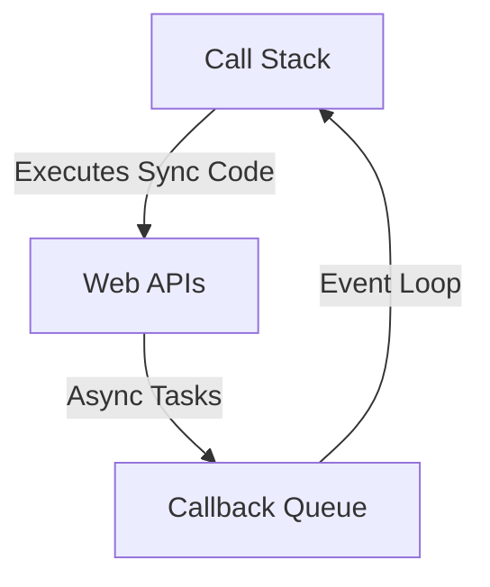

[⬅️ Back to Table of Contents](README.md)

# Event Loop & Asynchronous Operations

**Answer:**  
The event loop enables JavaScript to handle asynchronous operations by offloading tasks (like I/O) to browser/Node.js APIs. The call stack runs synchronous code, while async callbacks are queued and executed when the stack is empty.

---
