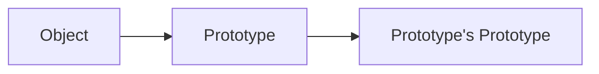

[⬅️ Back to Table of Contents](README.md)
 
# Prototypal Inheritance

Objects inherit from other objects via the prototype chain. Property lookups traverse this chain.

```mermaid
graph LR
    A[Object] --> B[Prototype]
    B --> C[Prototype's Prototype]
```
